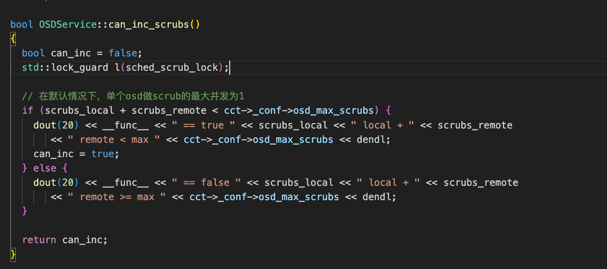
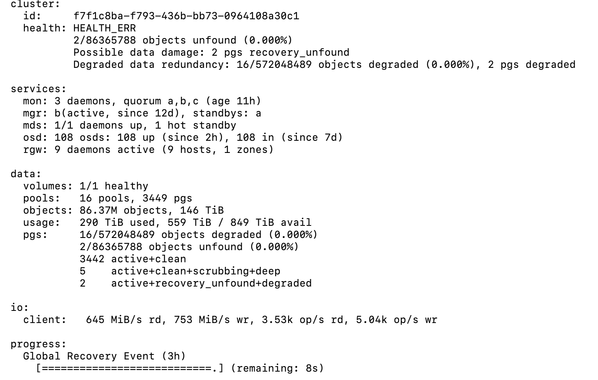

# 					ceph

- **为什么radosgw-admin返回的存储桶中的对象数和通过 s3cmd 看到的存储桶中的对象数不同呢？**

  想到的解决方法就是查看 bucket index 记录的存储桶中的对象列表来查看存储桶中到底有哪些对象。通过执行

  ```shell
  $ rados-admin bucket stats --bucket <bucket-name>
  ```

  从中获取到存储桶的 id 为 29b4947b-d038-4511-bd36-9b2c9a2f45e7.271450.1，再执行

  ```shell
  $ rados -p default.rgw.buckets.index ls |grep "29b4947b-d038-4511-bd36-9b2c9a2f45e7.271450.1" | awk '{print "rados listomapkeys -p default.rgw.buckets.index "$1 }'|sh -x 
  ```

  来打印出存储桶的 bucket index 中记录的存储桶中所有对象，结果如下：

  ```
  + rados listomapkeys -p default.rgw.buckets.index .dir.29b4947b-d038-4511-bd36-9b2c9a2f45e7.271450.1.391
  + rados listomapkeys -p default.rgw.buckets.index .dir.29b4947b-d038-4511-bd36-9b2c9a2f45e7.271450.1.390
  IMG_5741.jpg
  + rados listomapkeys -p default.rgw.buckets.index .dir.29b4947b-d038-4511-bd36-9b2c9a2f45e7.271450.1.178
  + rados listomapkeys -p default.rgw.buckets.index .dir.29b4947b-d038-4511-bd36-9b2c9a2f45e7.271450.1.106
  + rados listomapkeys -p default.rgw.buckets.index .dir.29b4947b-d038-4511-bd36-9b2c9a2f45e7.271450.1.16
  + rados listomapkeys -p default.rgw.buckets.index .dir.29b4947b-d038-4511-bd36-9b2c9a2f45e7.271450.1.221
  + rados listomapkeys -p default.rgw.buckets.index .dir.29b4947b-d038-4511-bd36-9b2c9a2f45e7.271450.1.231
  …
  + rados listomapkeys -p default.rgw.buckets.index .dir.29b4947b-d038-4511-bd36-9b2c9a2f45e7.271450.1.241
  + rados listomapkeys -p default.rgw.buckets.index .dir.29b4947b-d038-4511-bd36-9b2c9a2f45e7.271450.1.254
  + rados listomapkeys -p default.rgw.buckets.index .dir.29b4947b-d038-4511-bd36-9b2c9a2f45e7.271450.1.510
  + rados listomapkeys -p default.rgw.buckets.index .dir.29b4947b-d038-4511-bd36-9b2c9a2f45e7.271450.1.93
  + rados listomapkeys -p default.rgw.buckets.index .dir.29b4947b-d038-4511-bd36-9b2c9a2f45e7.271450.1.483
  + rados listomapkeys -p default.rgw.buckets.index .dir.29b4947b-d038-4511-bd36-9b2c9a2f45e7.271450.1.317
  + rados listomapkeys -p default.rgw.buckets.index .dir.29b4947b-d038-4511-bd36-9b2c9a2f45e7.271450.1.144
  _multipart_ubuntu-15.10-server-amd64.iso.2~myIwQyZP4UXG2pm-8ADCXLerI0TPpIw.meta
  _multipart_ubuntu-15.10-server-amd64.iso.2~qgWv0FnHPbHcaerV-wj_G-U0Cwof52y.meta
  + rados listomapkeys -p default.rgw.buckets.index .dir.29b4947b-d038-4511-bd36-9b2c9a2f45e7.271450.1.419
  + rados listomapkeys -p default.rgw.buckets.index .dir.29b4947b-d038-4511-bd36-9b2c9a2f45e7.271450.1.458
  + rados listomapkeys -p default.rgw.buckets.index .dir.29b4947b-d038-4511-bd36-9b2c9a2f45e7.271450.1.253
  + rados listomapkeys -p default.rgw.buckets.index .dir.29b4947b-d038-4511-bd36-9b2c9a2f45e7.271450.1.69
  …
  + rados listomapkeys -p default.rgw.buckets.index .dir.29b4947b-d038-4511-bd36-9b2c9a2f45e7.271450.1.414
  + rados listomapkeys -p default.rgw.buckets.index .dir.29b4947b-d038-4511-bd36-9b2c9a2f45e7.271450.1.40
  + rados listomapkeys -p default.rgw.buckets.index .dir.29b4947b-d038-4511-bd36-9b2c9a2f45e7.271450.1.206
  + rados listomapkeys -p default.rgw.buckets.index .dir.29b4947b-d038-4511-bd36-9b2c9a2f45e7.271450.1.108
  + rados listomapkeys -p default.rgw.buckets.index .dir.29b4947b-d038-4511-bd36-9b2c9a2f45e7.271450.1.25
  + rados listomapkeys -p default.rgw.buckets.index .dir.29b4947b-d038-4511-bd36-9b2c9a2f45e7.271450.1.292
  + rados listomapkeys -p default.rgw.buckets.index .dir.29b4947b-d038-4511-bd36-9b2c9a2f45e7.271450.1.137
  _multipart_ubuntu-14.04.3-server-amd64.iso.2~mfAysNmQgucoeAZ6CtjEvOiBOKkgbUh.1
  _multipart_ubuntu-14.04.3-server-amd64.iso.2~mfAysNmQgucoeAZ6CtjEvOiBOKkgbUh.2
  _multipart_ubuntu-14.04.3-server-amd64.iso.2~mfAysNmQgucoeAZ6CtjEvOiBOKkgbUh.3
  _multipart_ubuntu-14.04.3-server-amd64.iso.2~mfAysNmQgucoeAZ6CtjEvOiBOKkgbUh.4
  _multipart_ubuntu-14.04.3-server-amd64.iso.2~mfAysNmQgucoeAZ6CtjEvOiBOKkgbUh.meta
  + rados listomapkeys -p default.rgw.buckets.index .dir.29b4947b-d038-4511-bd36-9b2c9a2f45e7.271450.1.331
  + rados listomapkeys -p default.rgw.buckets.index .dir.29b4947b-d038-4511-bd36-9b2c9a2f45e7.271450.1.139
  + rados listomapkeys -p default.rgw.buckets.index .dir.29b4947b-d038-4511-bd36-9b2c9a2f45e7.271450.1.200
  + rados listomapkeys -p default.rgw.buckets.index .dir.29b4947b-d038-4511-bd36-9b2c9a2f45e7.271450.1.321
  + rados listomapkeys -p default.rgw.buckets.index .dir.29b4947b-d038-4511-bd36-9b2c9a2f45e7.271450.1.375
  + rados listomapkeys -p default.rgw.buckets.index .dir.29b4947b-d038-4511-bd36-9b2c9a2f45e7.271450.1.245
  + rados listomapkeys -p default.rgw.buckets.index .dir.29b4947b-d038-4511-bd36-9b2c9a2f45e7.271450.1.249
  + rados listomapkeys -p default.rgw.buckets.index .dir.29b4947b-d038-4511-bd36-9b2c9a2f45e7.271450.1.293
  + rados listomapkeys -p default.rgw.buckets.index .dir.29b4947b-d038-4511-bd36-9b2c9a2f45e7.271450.1.97
  + rados listomapkeys -p default.rgw.buckets.index .dir.29b4947b-d038-4511-bd36-9b2c9a2f45e7.271450.1.485
  + rados listomapkeys -p default.rgw.buckets.index .dir.29b4947b-d038-4511-bd36-9b2c9a2f45e7.271450.1.15
  + rados listomapkeys -p default.rgw.buckets.index .dir.29b4947b-d038-4511-bd36-9b2c9a2f45e7.271450.1.199
  + rados listomapkeys -p default.rgw.buckets.index .dir.29b4947b-d038-4511-bd36-9b2c9a2f45e7.271450.1.314
  + rados listomapkeys -p default.rgw.buckets.index .dir.29b4947b-d038-4511-bd36-9b2c9a2f45e7.271450.1.20
  + rados listomapkeys -p default.rgw.buckets.index .dir.29b4947b-d038-4511-bd36-9b2c9a2f45e7.271450.1.473
  + rados listomapkeys -p default.rgw.buckets.index .dir.29b4947b-d038-4511-bd36-9b2c9a2f45e7.271450.1.310
  + rados listomapkeys -p default.rgw.buckets.index .dir.29b4947b-d038-4511-bd36-9b2c9a2f45e7.271450.1.304
  + rados listomapkeys -p default.rgw.buckets.index .dir.29b4947b-d038-4511-bd36-9b2c9a2f45e7.271450.1.32
  + rados listomapkeys -p default.rgw.buckets.index .dir.29b4947b-d038-4511-bd36-9b2c9a2f45e7.271450.1.201
  + rados listomapkeys -p default.rgw.buckets.index .dir.29b4947b-d038-4511-bd36-9b2c9a2f45e7.271450.1.323
  + rados listomapkeys -p default.rgw.buckets.index .dir.29b4947b-d038-4511-bd36-9b2c9a2f45e7.271450.1.462
  + rados listomapkeys -p default.rgw.buckets.index .dir.29b4947b-d038-4511-bd36-9b2c9a2f45e7.271450.1.171
  + rados listomapkeys -p default.rgw.buckets.index .dir.29b4947b-d038-4511-bd36-9b2c9a2f45e7.271450.1.27
  + rados listomapkeys -p default.rgw.buckets.index .dir.29b4947b-d038-4511-bd36-9b2c9a2f45e7.271450.1.507
  + rados listomapkeys -p default.rgw.buckets.index .dir.29b4947b-d038-4511-bd36-9b2c9a2f45e7.271450.1.58
  + rados listomapkeys -p default.rgw.buckets.index .dir.29b4947b-d038-4511-bd36-9b2c9a2f45e7.271450.1.457
  + rados listomapkeys -p default.rgw.buckets.index .dir.29b4947b-d038-4511-bd36-9b2c9a2f45e7.271450.1.119
  + rados listomapkeys -p default.rgw.buckets.index .dir.29b4947b-d038-4511-bd36-9b2c9a2f45e7.271450.1.250
  + rados listomapkeys -p default.rgw.buckets.index .dir.29b4947b-d038-4511-bd36-9b2c9a2f45e7.271450.1.209
  + rados listomapkeys -p default.rgw.buckets.index .dir.29b4947b-d038-4511-bd36-9b2c9a2f45e7.271450.1.126
  + rados listomapkeys -p default.rgw.buckets.index .dir.29b4947b-d038-4511-bd36-9b2c9a2f45e7.271450.1.308
  + rados listomapkeys -p default.rgw.buckets.index .dir.29b4947b-d038-4511-bd36-9b2c9a2f45e7.271450.1.333
  + rados listomapkeys -p default.rgw.buckets.index .dir.29b4947b-d038-4511-bd36-9b2c9a2f45e7.271450.1.152
  + rados listomapkeys -p default.rgw.buckets.index .dir.29b4947b-d038-4511-bd36-9b2c9a2f45e7.271450.1.150
  + rados listomapkeys -p default.rgw.buckets.index .dir.29b4947b-d038-4511-bd36-9b2c9a2f45e7.271450.1.177
  + rados listomapkeys -p default.rgw.buckets.index .dir.29b4947b-d038-4511-bd36-9b2c9a2f45e7.271450.1.417
  + rados listomapkeys -p default.rgw.buckets.index .dir.29b4947b-d038-4511-bd36-9b2c9a2f45e7.271450.1.470
  + rados listomapkeys -p default.rgw.buckets.index .dir.29b4947b-d038-4511-bd36-9b2c9a2f45e7.271450.1.411
  + rados listomapkeys -p default.rgw.buckets.index .dir.29b4947b-d038-4511-bd36-9b2c9a2f45e7.271450.1.179
  + rados listomapkeys -p default.rgw.buckets.index .dir.29b4947b-d038-4511-bd36-9b2c9a2f45e7.271450.1.173
  + rados listomapkeys -p default.rgw.buckets.index .dir.29b4947b-d038-4511-bd36-9b2c9a2f45e7.271450.1.161
  + rados listomapkeys -p default.rgw.buckets.index .dir.29b4947b-d038-4511-bd36-9b2c9a2f45e7.271450.1.481
  + rados listomapkeys -p default.rgw.buckets.index .dir.29b4947b-d038-4511-bd36-9b2c9a2f45e7.271450.1.406
  + rados listomapkeys -p default.rgw.buckets.index .dir.29b4947b-d038-4511-bd36-9b2c9a2f45e7.271450.1.154
  + rados listomapkeys -p default.rgw.buckets.index .dir.29b4947b-d038-4511-bd36-9b2c9a2f45e7.271450.1.268
  + rados listomapkeys -p default.rgw.buckets.index .dir.29b4947b-d038-4511-bd36-9b2c9a2f4
  ```

  到这里，我们就看出了问题的原因所在，原来存储桶中，还存在

  ```
  _multipart_ubuntu-14.04.3-server-amd64.iso.2~mfAysNmQgucoeAZ6CtjEvOiBOKkgbUh.1
  _multipart_ubuntu-14.04.3-server-amd64.iso.2~mfAysNmQgucoeAZ6CtjEvOiBOKkgbUh.2
  _multipart_ubuntu-14.04.3-server-amd64.iso.2~mfAysNmQgucoeAZ6CtjEvOiBOKkgbUh.3
  _multipart_ubuntu-14.04.3-server-amd64.iso.2~mfAysNmQgucoeAZ6CtjEvOiBOKkgbUh.4
  ```

  这样几个 multipart 的分片数据对象。

​		**备注**：使用listomapkeys可以先读出桶中所有的对象列表，rclone基于对象列表做迁移，可以提高迁移速度

- **rgw gc参数解释**
  1. GC worker的数量由rgw_gc_max_objs来控制，设置这个参数的时候要考虑到你线上业务是否会有大量的GC操作，不要盲目调高。默认，32。
  1. rgw_gc_processor_max_time控制每次GC任务最多能够执行的时长，要考虑到你底层存储设备的负载情况，高速存储设备可以适当缩小，但是当底层存储设备比较慢并且负载较高的时候，考虑到GC的额外性能消耗，可能就要调大这个时长了。默认，1小时。
  1. rgw_gc_obj_min_wait 这个控制删除数据以后多久以后开始真正的底层数据回收，默认是2小时，如果线上对空间资源利用率比较敏感，可以适当缩短。
  1. rgw_gc_processor_period 这个控制多久时长以后GCworker开始下一轮的GC操作，如果单次GC需要操作的列表条目数较少，可以适当缩短这个参数。


- **ceph mgr相关操作**

  ```shell
  查看mgr services
  $ ceph mgr services
  
  查看mgr config
  $ ceph config dump | grep mgr
  
  配置mgr dashboard address
  $ ceph config set mgr mgr/dashboard/server_addr 10.x.x.x
  
  配置mgr dashboard port
  $ ceph config set mgr.x  mgr/dashboard/server_port $port
  
  配置mgr dashboard ssl
  $ ceph config set mgr.x mgr/dashboard/ssl false
  
  打开mgr dashboard
  $ ceph mgr module enable dashboard
  
  关闭mgr dashboard
  $ ceph mgr module disable dashboard
  
  删除mgr dashboard相关配置
  $ ceph config rm mgr.x mgr/dashboard/ssl
  
  查看mgr module打开情况
  $ ceph mgr moudle ls
  
  ```

  **备注：相关问题https://github.com/rook/rook/pull/11932**

- **调整osd的日志等级**

  ```
  $ ceph tell osd.* injectargs '--debug-osd 20' //默认日志等级为10
  ```

- 如何解决"Large omap objects"

  https://gist.github.com/likid0/4deb8bfd40660bdd125f3f89aa5245f4

- **ceph debug**

  1. 编译可调式ceph源码，启动单节点ceph集群

    ```shell
    $ cd /home/xxx/workspace # 此目录用户指定，用于下载ceph的代码
    $ git clone git@github.com:ceph/ceph
    $ git checkout -b v16.2.12 v16.2.12
    $ docker run -v /home/xxx/workspace/ceph:/ceph -ti quay.io/centos/centos:stream bash
    $ cd /ceph
    $ 修改./install-deps.sh脚本， 替换'pip >= 7.0'为'pip >= 21.0'
    $ dnf install git
    $ ./install-deps.sh
    $ ./do_cmake.sh -DCMAKE_BUILD_TYPE=RelWithDebInfo -DCMAKE_BUILD_TYPE=Debug  -DCMAKE_CXX_FLAGS_DEBUG="$CXX_FLAGS_DEBUG -O0 -g" -DCMAKE_C_FLAGS_DEBUG="$C_FLAGS_DEBUG -O0 -g"
    $ cd ./build && make -j8
    $ make vstart
    $ RGW=1 ../src/vstart.sh --debug --new -x --localhost --bluestore #启动单节点ceph集群
    
    # make help查询可编译的组件
    ```

   备注：更方便在容器内debug的container运行方式，**docker run --network host --cap-add=SYS_MODULE --security-opt seccomp=unconfined -v /home/deeproute/workspace/ceph:/ceph -v /sys/kernel/debug:/sys/kernel/debug -v /usr/src/kernels:/usr/src/kernels -v /usr/lib/modules/:/usr/lib/modules/ -v /usr/lib/debug:/usr/lib/debug -ti zhucan/centos:stream-env  bash**

  2. debug  "ceph" cmd

    ```shell
    $ gdb --args python3 ./bin/ceph -s
    $ b xxx #设置断点
    $ r #运行程序
    ```

  3. debug "radosgw-admin" cmd

    ```shell
    $ gdb --args ./bin/radosgw-admin user list
    $ b main #设置断点
    $ r #运行程序
    ```

  4.  动态设置debug等级

  ```shell
  $ ./bin/radosgw-admin user list --debug-ms=20
  ```

  ​	更多日志等级设置，请查看：https://docs.ceph.com/en/latest/rados/troubleshooting/log-and-debug/

  

- **如何关闭osd scrub和deep scrub**

  

  ```shell
  ceph config set osd osd_max_scrubs 0
  ```


- **如何修复“Possible data damage: 2 pgs recovery_unfound”**

  	
  
  ```shell
  $ ceph health detail  #查找有问题的pg
  $ ceph pg xx mark_unfound_lost delete #将有问题的pg标记为delete
  $ ceph pg dump | grep xx #查看pg是否恢复
  ```

- **RGW dynamic bucket sharding**

  - Backgroud：https://ceph.io/en/news/blog/2017/new-luminous-rgw-dynamic-bucket-sharding/

  - bucket resharding 的影响：阻塞write io, https://lists.ceph.io/hyperkitty/list/dev@ceph.io/thread/NG56XXAM5A4JONT4BGPQAZUTJAYMOSZ2/

  - 性能测试：https://www.redhat.com/zh/blog/ceph-rgw-dynamic-bucket-sharding-performance-investigation-and-guidance

- **手动使集群数据重平衡**

  基于pgremapper平衡数据：

  https://github.com/digitalocean/pgremapper

  基于ceph cmd平衡数据：

  ```shell
  $ ceph osd getmap -o om
  $ osdmaptool om --upmap out.txt --upmap-pool xxx --upmap-deviation 5 --upmap-max 10
  $ cat out.txt #查看需要执行的操作的pg
  $ source out.txt
  ```

- 使用ceph config设置scrub时间

  ```shell
  $ ceph config set osd osd_scrub_begin_hour 1
  $ ceph config set osd osd osd_scrub_end_hour 7
  $ ceph config set osd osd osd_scrub_begin_week_day 6
  $ ceph config set osd osd osd_scrub_end_week_day 7
  $ ceph config set mgr osd_deep_scrub_randomize_ratio  0
  ```

  